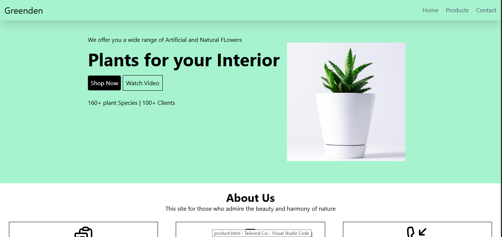

🌿 Greenden
Greenden is a simple and clean front-end web project built using Tailwind CSS, featuring a modern UI for a plant-themed website. The project includes the following pages:

🏠 Home Page – Showcases the brand and featured plant products.

🛒 Product Page – Displays a grid of plant products with pricing and descriptions.

📞 Contact Page – Provides a form and contact information for customer inquiries.

🚀 Features
Responsive design using Tailwind CSS utility classes

Fully static front-end (no JavaScript functionality)

Easy to customize and extend for personal or commercial projects

📁 Pages Included
index.html – Home Page

products.html – Product Listing Page

contact.html – Contact Page

🛠️ Tech Stack
HTML5

Tailwind CSS (CDN)

